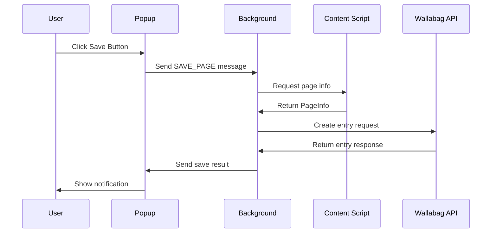

# 開発者ガイド

Wallabag Chrome Extension の開発に関する詳細なガイドです。

## 目次

1. [開発環境のセットアップ](#開発環境のセットアップ)
2. [アーキテクチャ](#アーキテクチャ)
3. [開発ワークフロー](#開発ワークフロー)
4. [テスト](#テスト)
5. [デバッグ](#デバッグ)
6. [ビルド・デプロイ](#ビルド・デプロイ)
7. [貢献ガイドライン](#貢献ガイドライン)

## 開発環境のセットアップ

### 前提条件

- **Node.js**: v18.0.0 以上
- **npm**: v9.0.0 以上
- **Google Chrome**: 最新版
- **Git**: 最新版

### 開発環境構築

1. **リポジトリのクローン**:
   ```bash
   git clone https://github.com/your-repo/wallabag-extension.git
   cd wallabag-extension
   ```

2. **依存関係のインストール**:
   ```bash
   npm install
   ```

3. **開発サーバーの起動**:
   ```bash
   npm run dev
   ```

4. **Chrome での拡張機能読み込み**:
   - Chrome の設定 → 拡張機能
   - デベロッパーモードを有効化
   - 「パッケージ化されていない拡張機能を読み込む」
   - `dist` フォルダを選択

### エディタ設定

#### VS Code 推奨設定

`.vscode/settings.json`:
```json
{
  "typescript.preferences.importModuleSpecifier": "relative",
  "editor.formatOnSave": true,
  "editor.codeActionsOnSave": {
    "source.fixAll.eslint": true,
    "source.organizeImports": true
  },
  "files.exclude": {
    "**/node_modules": true,
    "**/dist": true,
    "**/.git": true
  }
}
```

#### VS Code 推奨拡張機能

`.vscode/extensions.json`:
```json
{
  "recommendations": [
    "ms-vscode.vscode-typescript-next",
    "esbenp.prettier-vscode",
    "dbaeumer.vscode-eslint",
    "bradlc.vscode-tailwindcss",
    "christian-kohler.path-intellisense"
  ]
}
```

## アーキテクチャ

### 全体構成

```
┌─────────────────┐    ┌─────────────────┐
│   Popup UI      │    │   Options Page  │
└─────────────────┘    └─────────────────┘
         │                       │
         └───────────┬───────────┘
                     │
    ┌─────────────────────────────────┐
    │    Background Service Worker    │
    │  ┌─────────────────────────────┐│
    │  │      Message Handler       ││
    │  └─────────────────────────────┘│
    │  ┌─────────────────────────────┐│
    │  │    Wallabag API Client     ││
    │  └─────────────────────────────┘│
    │  ┌─────────────────────────────┐│
    │  │     Config Manager         ││
    │  └─────────────────────────────┘│
    └─────────────────────────────────┘
                     │
         ┌───────────┴───────────┐
         │                       │
┌─────────────────┐    ┌─────────────────┐
│  Content Script │    │  Wallabag API   │
└─────────────────┘    └─────────────────┘
```

### コンポーネント詳細

#### Background Service Worker
- Chrome Extension の中核部分
- API 通信とビジネスロジック
- イベント処理とメッセージルーティング
- 認証状態の管理

#### Content Script
- ウェブページからの情報抽出
- ページタイトル、URL、説明文の取得
- Background との通信

#### Popup UI
- ユーザーとの主要インターフェース
- ページ保存操作
- 状態表示とフィードバック

#### Options Page
- 設定管理画面
- Wallabag サーバー設定
- 認証情報の管理

### データフロー



## 開発ワークフロー

### ブランチ戦略

```
main
├── develop
│   ├── feature/new-feature
│   ├── bugfix/fix-issue
│   └── hotfix/urgent-fix
└── release/v1.1.0
```

### Git ワークフロー

1. **フィーチャー開発**:
   ```bash
   git checkout develop
   git pull origin develop
   git checkout -b feature/new-feature
   # 開発作業
   git add .
   git commit -m "feat: add new feature"
   git push origin feature/new-feature
   # Pull Request 作成
   ```

2. **バグ修正**:
   ```bash
   git checkout develop
   git checkout -b bugfix/fix-issue
   # 修正作業
   git commit -m "fix: resolve issue"
   git push origin bugfix/fix-issue
   ```

### コミットメッセージ規約

[Conventional Commits](https://www.conventionalcommits.org/) に従います：

```
<type>[optional scope]: <description>

[optional body]

[optional footer(s)]
```

#### Type

- `feat`: 新機能
- `fix`: バグ修正
- `docs`: ドキュメント変更
- `style`: コードスタイル修正
- `refactor`: リファクタリング
- `test`: テスト追加・修正
- `chore`: その他の変更

#### 例

```
feat(api): add token refresh mechanism

Implement automatic token refresh when API calls return 401 errors.
This improves user experience by avoiding manual re-authentication.

Closes #123
```

## テスト

### テスト構成

```
tests/
├── unit/           # 単体テスト
├── integration/    # 統合テスト
├── e2e/           # E2Eテスト
├── security/      # セキュリティテスト
├── performance/   # パフォーマンステスト
└── quality/       # コード品質テスト
```

### テスト実行

```bash
# 全テスト実行
npm test

# 特定テストスイート
npm test -- tests/unit/
npm test -- tests/integration/

# カバレッジ付き実行
npm run test:coverage

# Watch モード
npm run test:watch
```

### テスト作成ガイドライン

#### 単体テスト例

```typescript
// tests/unit/wallabag-api.test.ts
import { WallabagApiClient } from '../../src/lib/wallabag-api';

describe('WallabagApiClient', () => {
  let client: WallabagApiClient;

  beforeEach(() => {
    client = new WallabagApiClient('https://test.wallabag.com');
    global.fetch = jest.fn();
  });

  it('should authenticate successfully', async () => {
    const mockResponse = {
      access_token: 'test-token',
      expires_in: 3600,
      token_type: 'Bearer',
      scope: 'read write',
      refresh_token: 'refresh-token'
    };

    (global.fetch as jest.Mock).mockResolvedValueOnce({
      ok: true,
      json: () => Promise.resolve(mockResponse)
    });

    const result = await client.authenticate({
      grant_type: 'password',
      client_id: 'test-client',
      client_secret: 'test-secret',
      username: 'test-user',
      password: 'test-pass'
    });

    expect(result.access_token).toBe('test-token');
  });
});
```

#### モック戦略

```typescript
// Chrome API のモック
const mockChrome = {
  storage: {
    local: {
      get: jest.fn(),
      set: jest.fn(),
      remove: jest.fn(),
    },
  },
  runtime: {
    sendMessage: jest.fn(),
    onMessage: {
      addListener: jest.fn(),
    },
  },
  tabs: {
    query: jest.fn(),
    sendMessage: jest.fn(),
  },
};

global.chrome = mockChrome;
```

## デバッグ

### Chrome DevTools

#### Background Script のデバッグ

1. Chrome 拡張機能管理ページを開く
2. 拡張機能の「詳細」をクリック
3. 「service worker」リンクをクリック
4. DevTools が開き、Background Script をデバッグ可能

#### Content Script のデバッグ

1. 対象ページで F12 を押し DevTools を開く
2. Sources タブで Content Script ファイルを確認
3. ブレークポイントを設定してデバッグ

#### Popup のデバッグ

1. 拡張機能アイコンを右クリック
2. 「ポップアップを検証」を選択
3. DevTools で Popup をデバッグ

### ログ出力

#### 開発環境用ログ

```typescript
// src/lib/logger.ts
export class Logger {
  static debug(message: string, ...args: any[]): void {
    if (process.env.NODE_ENV === 'development') {
      console.log(`[DEBUG] ${message}`, ...args);
    }
  }

  static error(message: string, error?: Error): void {
    console.error(`[ERROR] ${message}`, error);
  }
}
```

#### ログレベル設定

```typescript
// 開発時の詳細ログ
Logger.setLevel(LogLevel.DEBUG);

// 本番時のエラーログのみ
Logger.setLevel(LogLevel.ERROR);
```

### デバッグ用ユーティリティ

```typescript
// src/lib/debug.ts
export class DebugUtils {
  static dumpStorage(): void {
    chrome.storage.local.get(null, (items) => {
      console.table(items);
    });
  }

  static clearStorage(): void {
    chrome.storage.local.clear();
    console.log('Storage cleared');
  }

  static simulateError(): void {
    throw new Error('Debug error simulation');
  }
}

// DevTools コンソールで使用
// DebugUtils.dumpStorage();
```

## ビルド・デプロイ

### ビルドプロセス

```bash
# 開発ビルド
npm run build

# 本番最適化ビルド
npm run build:prod

# バンドルサイズ分析
npm run build:analyze
```

### デプロイメント

#### Chrome Web Store

1. **パッケージ作成**:
   ```bash
   npm run package
   ```

2. **アップロード**:
   - [Chrome Developer Dashboard](https://chrome.google.com/webstore/devconsole/) にアクセス
   - zip ファイルをアップロード
   - ストア情報を入力
   - 審査に提出

3. **リリース後監視**:
   ```bash
   npm run monitor
   ```

#### 継続的インテグレーション

`.github/workflows/ci.yml`:
```yaml
name: CI

on:
  push:
    branches: [ main, develop ]
  pull_request:
    branches: [ main ]

jobs:
  test:
    runs-on: ubuntu-latest
    
    steps:
    - uses: actions/checkout@v3
    
    - name: Setup Node.js
      uses: actions/setup-node@v3
      with:
        node-version: '18'
        cache: 'npm'
    
    - name: Install dependencies
      run: npm ci
    
    - name: Run tests
      run: npm test
    
    - name: Build
      run: npm run build:prod
    
    - name: Upload coverage
      uses: codecov/codecov-action@v3
```

## 貢献ガイドライン

### コーディング規約

#### TypeScript

```typescript
// ✅ Good
interface UserConfig {
  serverUrl: string;
  credentials: AuthCredentials;
}

class ConfigManager {
  private static instance: ConfigManager;
  
  public static getInstance(): ConfigManager {
    if (!ConfigManager.instance) {
      ConfigManager.instance = new ConfigManager();
    }
    return ConfigManager.instance;
  }
}

// ❌ Bad
let user_config: any = {};
function getConfig() { /* ... */ }
```

#### ESLint 設定

```json
{
  "extends": [
    "@typescript-eslint/recommended",
    "prettier"
  ],
  "rules": {
    "@typescript-eslint/explicit-function-return-type": "error",
    "@typescript-eslint/no-unused-vars": "error",
    "@typescript-eslint/prefer-const": "error"
  }
}
```

### プルリクエスト

#### PR チェックリスト

- [ ] テストが通る
- [ ] ESLint エラーがない
- [ ]型チェックが通る
- [ ] ドキュメントが更新されている
- [ ] CHANGELOG.md が更新されている

#### PR テンプレート

```markdown
## 概要
このPRの目的と変更内容を簡潔に説明

## 変更内容
- [ ] 新機能: XXX
- [ ] バグ修正: XXX
- [ ] リファクタリング: XXX

## テスト
- [ ] 単体テスト追加
- [ ] 統合テスト追加
- [ ] 手動テスト実施

## スクリーンショット
（UIの変更がある場合）

## 関連Issue
Closes #123
```

### コードレビュー

#### レビュー観点

1. **機能性**: 仕様通りに動作するか
2. **パフォーマンス**: 性能に問題はないか
3. **セキュリティ**: セキュリティホールはないか
4. **可読性**: コードは理解しやすいか
5. **テスタビリティ**: テストは適切か

#### レビューコメント例

```markdown
## 良い例
> 👍 この実装はとてもエレガントですね！エラーハンドリングも適切です。

## 改善提案
> 💡 この関数は少し複雑に見えます。小さな関数に分割することを検討してみてください。

## 重要な指摘
> ⚠️ この部分でメモリリークが発生する可能性があります。適切なクリーンアップを追加してください。
```

### リリース管理

#### バージョニング

[Semantic Versioning](https://semver.org/) に従います：

- **MAJOR**: 破壊的変更
- **MINOR**: 新機能追加
- **PATCH**: バグ修正

#### リリースプロセス

1. **リリースブランチ作成**:
   ```bash
   git checkout develop
   git checkout -b release/v1.1.0
   ```

2. **バージョン更新**:
   ```bash
   npm version 1.1.0
   ```

3. **リリースノート作成**:
   - CHANGELOG.md 更新
   - GitHub Release 作成

4. **マージとタグ**:
   ```bash
   git checkout main
   git merge release/v1.1.0
   git tag v1.1.0
   git push origin main --tags
   ```

## 参考資料

### 公式ドキュメント

- [Chrome Extension API](https://developer.chrome.com/docs/extensions/reference/)
- [Manifest V3](https://developer.chrome.com/docs/extensions/mv3/)
- [Wallabag API](https://doc.wallabag.org/en/developer/api/readme.html)

### 開発ツール

- [web-ext](https://github.com/mozilla/web-ext): 拡張機能開発ツール
- [Chrome Extension Type](https://github.com/DefinitelyTyped/DefinitelyTyped/tree/master/types/chrome): TypeScript 型定義

### ベストプラクティス

- [Chrome Extension Best Practices](https://developer.chrome.com/docs/extensions/mv3/intro/mv3-overview/)
- [Security Best Practices](https://developer.chrome.com/docs/extensions/mv3/security/)

---

このガイドを参考に、効率的で高品質な開発を行ってください。質問や提案があれば、Issue や Discussion でお聞かせください！